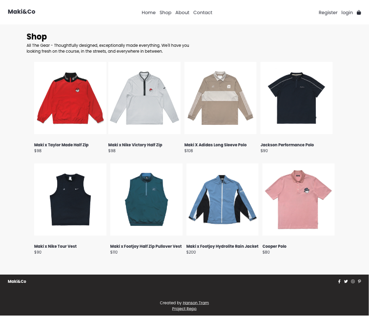

# E-Commerce Website

This website was designed and built for an e-commerce store selling golf streetwear apparel using HTML, CSS, & Javascript. All pages are responsive with the implementation of media queries. 

#### 🔗 [ Maki&Co](makiapparel.netlify.app)


### Features:

Maki&Co websites pages include:

<details>
  <summary>Home</summary>
  

</details>
<details>
  <summary>Shop</summary>
  
</details>
<details>
  <summary>Product</summary>
   
</details>
<details>
  <summary>Checkout</summary>
   
   
   <p>This piece of css code was particularly interesting to me because it was the first time I used `flex-direction: row-reverse` instead of `row` on a media query to shift the cart container to the right in order to make the page responsive. </p>

</details>
<details>
  <summary>Login</summary>
  
</details>
<details>
  <summary>Register</summary>
   

</details>

#### Run Locally:

##### 1. Clone project:

```javascript
git clone : https://github.com/hansontram/ecom-website.git
```

##### 2. Open in text editor:

- Open the file in your text editor and view the pages, css, & scripts folders
##### 3. Open in browser:

- Then open index.html in your browser or run live server extension to view the website

### Lessons learned
- Working with different input types
- Implementing html tables
- More practice with flexbox
- Creating a responsive website using media queries